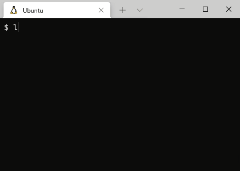

# gunicorn daemon controller



## Disclaimer warning

- There is NO WARRANTY!
- Take no responsibility for any of this.

## Confirmed environment

- Ubuntu 20.04.2 LTS
- GNU bash, version 5.0.17(1)-release (x86_64-pc-linux-gnu)
- Python 3.8.10 (venv)

```
fastapi==0.65.2
gunicorn==20.1.0
setproctitle==1.2.2
uvicorn==0.14.0
```

# Isntall packages using by PIP

```
pip install -r requirements.txt
```

## Overview

- Control the gunicorn's daemons using by Bash.

## Structure of files

```
├── gunicorn_config            <-- gunicorn config files
│   ├── guni_conf_prod.py
│   └── guni_conf_staging.py
├── gunidaemonctl              <-- Bash script
├── main.py                    <-- Python Web app for prod
└── main_fast_api.py           <-- Python Web app for staging
```

## config


### Apps config

- Set path for gunicorn config files.

```
vim gunidaemonctl

GUNICORN_CONFIG_PATH="./gunicorn_config/"
```

### gunicorn config

- Create gunicorn config files.
- The filename must be same as proc_name.

```bash
vim gunicorn_config/guni_conf_staging.py

proc_name = 'guni_conf_staging' # The proc name must be set to the same value as the filename of gunicorn config.
```

## Command

### Outline

```
./gunidaemonctl [command] [app_id]
```

- [command] : start | ps | pid | stop
- [app_id]  : proc_name


### Start the daemon

```
./gunidaemonctl start guni_conf_staging
```


### Stop the daemon

```
./gunidaemonctl stop guni_conf_staging
```

#### Show the processes

```
./gunidaemonctl ps guni_conf_staging

ubuntu 1001 0.8 2.2 0 0 ? S 12:10 0:00 gunicorn: master [guni_conf_staging]
ubuntu 1002 2.4 3.3 0 0 ? S 12:10 0:00 gunicorn: worker [guni_conf_staging]
ubuntu 1003 2.4 3.3 0 0 ? S 12:10 0:00 gunicorn: worker [guni_conf_staging]
```

### Show the pid of the master of the workers

```
./gunidaemonctl pid guni_conf_staging

master pid:
1001
```
